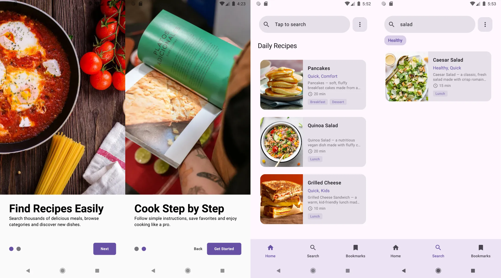
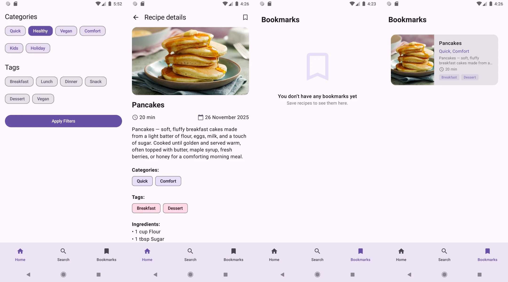

## Recipe App - Android
Android application for browsing, searching, filtering, and bookmarking recipes using Jetpack Compose and Kotlin.

## Features
- Browse recipes
- Search recipes
- Filter by categories and tags
- Bookmark favorites

## Architecture
- **MVVM Architecture** – separates UI from business logic
- **Jetpack Compose UI** – modern declarative UI for Android
- **Dagger Hilt** – dependency injection
- **Retrofit** – for communicating with REST API
- **Room** – local database for bookmarks and caching
- **Coil** – image loading and caching

## Backend

This app was developed together with a custom example backend built using Django REST Framework.
The backend manages recipes, categories, tags, and user bookmarks.
[Recipe App Backend](https://github.com/UkraintetsAndriyKPI/recipe-app-backend)